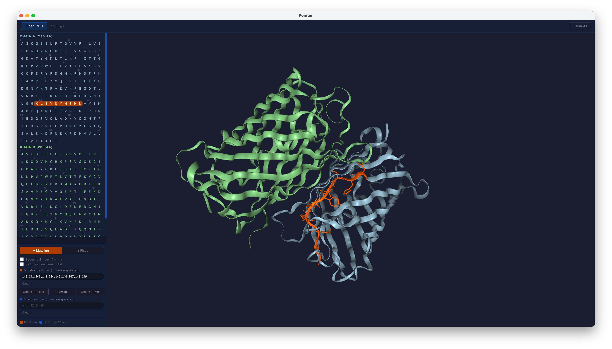

# pointer
Interactive PDB viewer for labeling mutation and fixed residues, with linked 3D and sequence panels.



## Download

Prebuilt binaries are available on the Releases page.

> If the downloaded app doesn't run, try building from source instead (see below).

## Build from source

```bash
git clone https://github.com/yukihada/pointer.git
cd pointer
npm install
npm start
```
